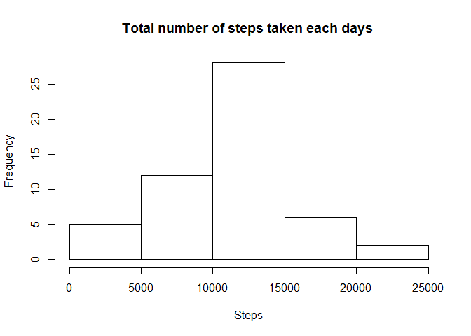
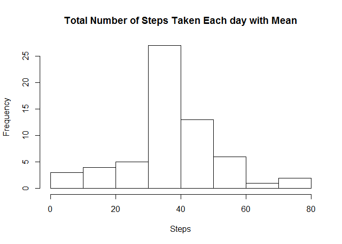
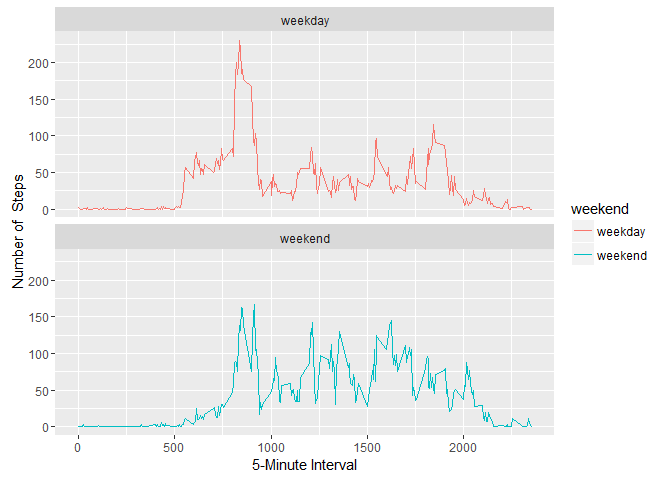

# Reproducible Research: Peer Assessment 1


## Loading and preprocessing the data


```r
activity <- read.csv("activity.csv")
dim (activity)
```

```
## [1] 17568     3
```

```r
str(activity)
```

```
## 'data.frame':	17568 obs. of  3 variables:
##  $ steps   : int  NA NA NA NA NA NA NA NA NA NA ...
##  $ date    : Factor w/ 61 levels "2012-10-01","2012-10-02",..: 1 1 1 1 1 1 1 1 1 1 ...
##  $ interval: int  0 5 10 15 20 25 30 35 40 45 ...
```


## What is mean total number of steps taken per day?

Removing the missing Value 

```r
activity <- na.omit(activity)
head(activity)
```

```
##     steps       date interval
## 289     0 2012-10-02        0
## 290     0 2012-10-02        5
## 291     0 2012-10-02       10
## 292     0 2012-10-02       15
## 293     0 2012-10-02       20
## 294     0 2012-10-02       25
```


1. The histogram of the total number of steps taken each day


```r
Activityperday <- aggregate(steps~date,data = activity, FUN = sum , na.rm = TRUE)
hist(Activityperday$steps, main = "Total number of steps taken each days ", xlab = "Steps")
```

<!-- -->

```r
names(activity)
```

```
## [1] "steps"    "date"     "interval"
```
2. Calculate and Report the mean and median total number of steps taken per day 


```r
mean(Activityperday$steps)
```

```
## [1] 10766.19
```

```r
median(Activityperday$steps)
```

```
## [1] 10765
```
## What is the average daily activity pattern?

1. Time series plot (i.e type = "l") of the 5 minute interval (x-axis) and the average number of steps taken, averages across all days

The logic here is to aggregrate how many step was taken in each interval and calculate the mean of the step taken by day

```r
library(ggplot2)

  
df_activity <- aggregate(steps ~ interval, data = activity, mean)
head(df_activity)
```

```
##   interval     steps
## 1        0 1.7169811
## 2        5 0.3396226
## 3       10 0.1320755
## 4       15 0.1509434
## 5       20 0.0754717
## 6       25 2.0943396
```

```r
ggplot(df_activity, aes(x = interval, y = steps)) + geom_line()
```

<!-- -->

2. The 5-minute interval that, on average, contains the maximum number of steps 

. In the Average data frame (df_activity) we must find the interval that contain the maximum number of step

```r
act_bystep <- which.max(df_activity$steps)

## display the row position of the maximum number
act_bystep
```

```
## [1] 104
```

```r
df_activity[act_bystep,]
```

```
##     interval    steps
## 104      835 206.1698
```
## Imputing missing values

1. Total number of missing values in the dataset

```r
activity <- read.csv("activity.csv")
sum(is.na(activity))
```

```
## [1] 2304
```
2. Devise a strategy for filling in all of the missing values in the dataset. The strategy does not need to be sophisticated. For example, you could use the mean/median for that day, or the mean for that 5-minute interval, et

 #  We choose to use the mean to of each step by interval 

```r
## Reading the activity data
activity <- read.csv("activity.csv")

## the data with missing value
dim (activity)
```

```
## [1] 17568     3
```

```r
# AGregate the activity by calculating the mean of each step by interval

activity2 <- aggregate(steps~interval, data = activity, FUN = mean , na.rm = TRUE)


## Now replace the missing value (NA) with the mean


for( x in 1: nrow(activity)){
            
        if(is.na(activity$steps[x]) == TRUE){
                           
                #get the number of the interval from the missing value                
                NAval<-activity[x,3]
                          
                # once we have the Interval value of the missing value , we can determine mean value from the activity2 table 
                  meanval <- subset(activity2, interval == NAval, select = steps)
                           
                # replace the NA of the activity by the mean of the interval
                          
                activity[x,1] = meanval
                           
                }
        

        }
```
3. Create a new dataset that is equal to the original dataset but with the missing data filled in


```r
## new data dimension without the missing value

ActivityNew <- activity 

dim (ActivityNew)
```

```
## [1] 17568     3
```

```r
## to verify if there is no more Missing Value

sum(is.na(ActivityNew))
```

```
## [1] 0
```

```r
names(ActivityNew)
```

```
## [1] "steps"    "date"     "interval"
```

```r
str(ActivityNew)
```

```
## 'data.frame':	17568 obs. of  3 variables:
##  $ steps   : num  1.717 0.3396 0.1321 0.1509 0.0755 ...
##  $ date    : Factor w/ 61 levels "2012-10-01","2012-10-02",..: 1 1 1 1 1 1 1 1 1 1 ...
##  $ interval: int  0 5 10 15 20 25 30 35 40 45 ...
```
4.Make a histogram of the total number of steps taken each day and Calculate and report the mean and median total number of steps taken per day. Do these values differ from the estimates from the first part of the assignment? What is the impact of imputing missing data on the estimates of the total daily number of steps?


```r
Act_step <- aggregate(steps ~ date, data = ActivityNew, FUN = mean)

hist(Act_step$steps, main = "Total Number of Steps Taken Each day with Mean" , xlab = "Steps")
```

<!-- -->


## Are there differences in activity patterns between weekdays and weekends?

1.Create a new factor variable in the dataset with two levels - "weekday" and "weekend" indicating whether a given date is a weekday or weekend day.


```r
ActivityNew$date <- as.Date(ActivityNew$date)
str(ActivityNew)
```

```
## 'data.frame':	17568 obs. of  3 variables:
##  $ steps   : num  1.717 0.3396 0.1321 0.1509 0.0755 ...
##  $ date    : Date, format: "2012-10-01" "2012-10-01" ...
##  $ interval: int  0 5 10 15 20 25 30 35 40 45 ...
```

```r
# adding another collumn that take the day and check if the day is a weekend and return TRUE or else FALSE 
ActivityNew$weekend <-  chron::is.weekend(ActivityNew$date) 

# once we fill the coloumn with the logical value TRUE and FALSE we can now replace it by checking if it TRUE then the day is te weekend else it is a week day.
for(x in 1:nrow(ActivityNew)){
   
        if (ActivityNew[x,4] ==TRUE)
        {
                
                ActivityNew[x,4] = "weekend"
                
        } else{
                
                ActivityNew[x,4] = "weekday"
        }
        
        
} 

#change the class of the column from Logical to Factor 
ActivityNew$weekend <- as.factor(ActivityNew$weekend)

#checking the result of the new dataset 
tail(ActivityNew)
```

```
##           steps       date interval weekend
## 17563 2.6037736 2012-11-30     2330 weekday
## 17564 4.6981132 2012-11-30     2335 weekday
## 17565 3.3018868 2012-11-30     2340 weekday
## 17566 0.6415094 2012-11-30     2345 weekday
## 17567 0.2264151 2012-11-30     2350 weekday
## 17568 1.0754717 2012-11-30     2355 weekday
```

```r
# describe the list of the summary of the dataset 
str(ActivityNew)
```

```
## 'data.frame':	17568 obs. of  4 variables:
##  $ steps   : num  1.717 0.3396 0.1321 0.1509 0.0755 ...
##  $ date    : Date, format: "2012-10-01" "2012-10-01" ...
##  $ interval: int  0 5 10 15 20 25 30 35 40 45 ...
##  $ weekend : Factor w/ 2 levels "weekday","weekend": 1 1 1 1 1 1 1 1 1 1 ...
```

2.Make a panel plot containing a time series plot (i.e. type = "l") of the 5-minute interval (x-axis) and the average number of steps taken, averaged across all weekday days or weekend days (y-axis). See the README file in the GitHub repository to see an example of what this plot should look like using simulated data.


```r
library(ggplot2)

stepsbyWeek <- aggregate(steps ~ interval + weekend, data = ActivityNew, FUN = mean)

dim(stepsbyWeek)
```

```
## [1] 576   3
```

```r
head(stepsbyWeek)
```

```
##   interval weekend      steps
## 1        0 weekday 2.25115304
## 2        5 weekday 0.44528302
## 3       10 weekday 0.17316562
## 4       15 weekday 0.19790356
## 5       20 weekday 0.09895178
## 6       25 weekday 1.59035639
```

```r
str(stepsbyWeek)
```

```
## 'data.frame':	576 obs. of  3 variables:
##  $ interval: int  0 5 10 15 20 25 30 35 40 45 ...
##  $ weekend : Factor w/ 2 levels "weekday","weekend": 1 1 1 1 1 1 1 1 1 1 ...
##  $ steps   : num  2.251 0.445 0.173 0.198 0.099 ...
```

```r
(d1 <- ggplot(data = stepsbyWeek, aes(x = interval, y = steps, color = weekend )) +    
        scale_x_continuous(name ="5-Minute Interval") + 
        scale_y_continuous(name = " Number of  Steps")+
        geom_line() + 
        facet_wrap(~weekend, nrow = 2))
```

<!-- -->

```r
#(d2<- d1 + facet_wrap(~weekend, nrow = 2))

#d2 + theme_linedraw()
```


